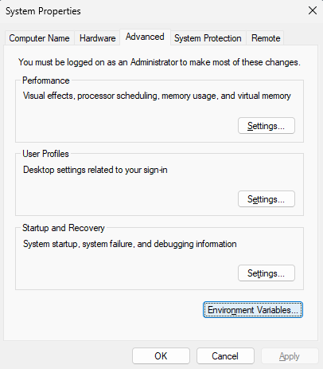

Linux/Mac
---
The best way to install jdk for non windows user is to use [sdkman](https://sdkman.io/).

Windows
---
- [ ] Download openjdk binaries for windows - https://jdk.java.net/java-se-ri/17.
- [ ] Extract contents to a directory, let's say its location is `D:\dev\jdk17`.
- [ ] Create an environment variable named `JAVA_HOME` that points precisely to the `D:\dev\jdk17`. 
You can manipulate environment variables under _System Properties -> Advanced -> Environment Variables_ section.
- [ ] Edit the `Path` environment variable adding a new value for it, which is precisely `%JAVA_HOME%\bin`.
- [ ] Open a command line and run `java -version`, if you see something like `openjdk version 17` you're set.

