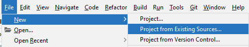
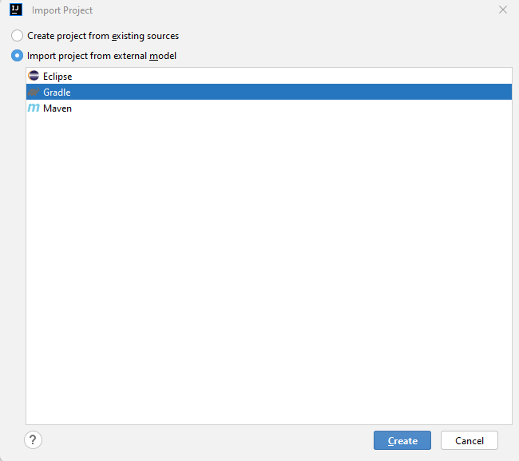
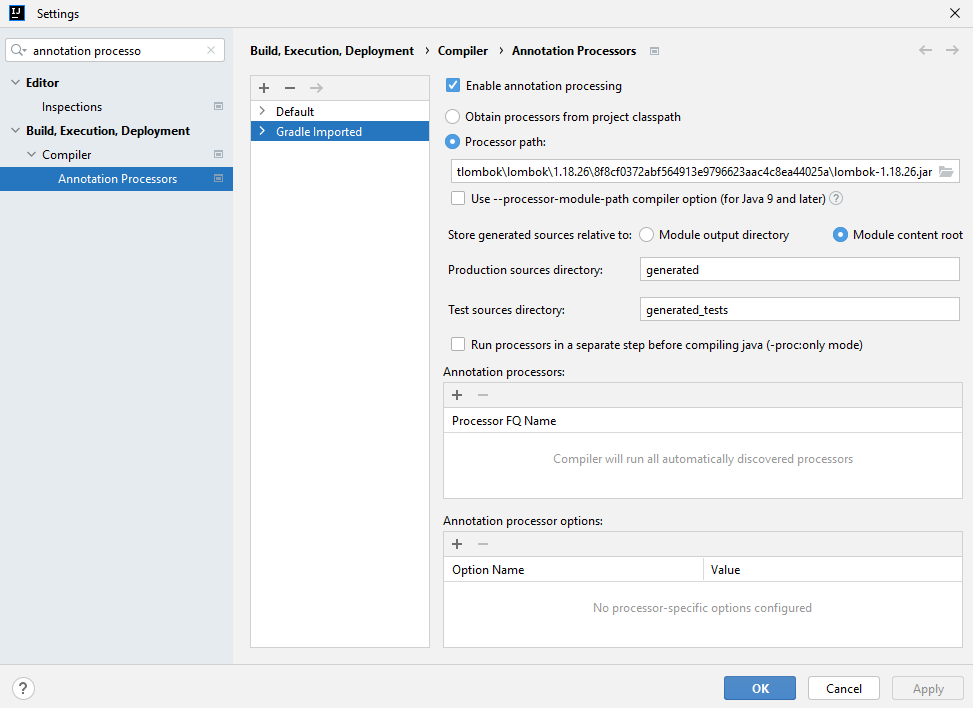
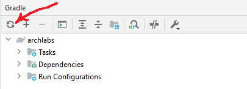

Import project using _File -> New -> Project from Existing Sources_:

Select _Import project from external model_ and use _gradle_:

Go to settings and enable annotation processing:

:warning: In case you switch branch or do something to dependencies in order for change to take effect 
use the gradle menu on the right and resycn project:

